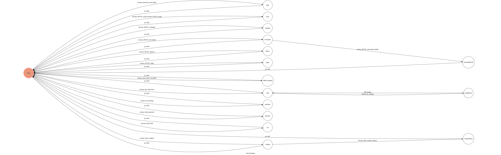

# NCKU knowhow bot - TOC Project 2017

A telegram bot based on a finite state machine.

## Purpose
**成大資訊一把通**： 學生在查詢一些學生相關事務往往會遇到一個問題，就是找不到該找誰or去哪問！ 這個bot的用意就是將一些學校事務整合在一起，方便查詢、減少浪費的時間，除此之外，也將一些學生生活上容易會遇到的問題放進去，增加更多的互動性。

## Setup

### Telegram Bot Generate

* Get a telegram account.

*  Message **@BotFather** and send `/nwebot`, get `API_TOKEN` and you can send requests to your bot now!


### Prerequisite
* Python 3

#### Install Dependency
```sh
pip install -r requirements.txt
```

* pygraphviz (For visualizing Finite State Machine)
    * [Setup pygraphviz on Ubuntu](http://www.jianshu.com/p/a3da7ecc5303)

### Secret Data

`API_TOKEN` and `WEBHOOK_URL` in app.py **MUST** be set to proper values.
Otherwise, you might not be able to run your code.

### Run Locally
You can either setup https server or using `ngrok` as a proxy.

**`ngrok` would be used in the following instruction**

```sh
./ngrok http 5000
```

After that, `ngrok` would generate a https URL.

You should set `WEBHOOK_URL` (in app.py) to `your-https-URL/hook`.

#### Run the sever

```sh
python3 app.py
```

## Finite State Machine
* viwe FSM dynamic => `https://WEBHOOK_URL/show-fsm`



## Usage
The initial state is set to `user`.
Except of `entering commands`, you can also use the `keyboard` to achieve this!


* **user**
    * Input: `/start`
        * Reply: bot本身以及commands的介紹
        
	* Input: `/map`
		* Reply: 

	* Input: `/calendar`
		* Reply: 成大行事曆的下載連結
		
	* Input: `/download`
		* Reply: 選擇download檔案

            * **downloadDetail**
             
                * Input: `1/2/3/exit`
                
                    * reply: 所選檔案下載連結 (ex:退選單、請假單)
		
	* Input: `/help`
		* Reply: 詳細的command介紹
		
	* Input: `/phone`
		* Reply: 成大各校安相關單位電話
		
	* Input: `/links`
		* Reply: 成大相關連結 (ex: moodle、成功入口)
		
	* Input: `/weather`
		* Reply: 請選擇查詢區域
		
            * **weatherWhere**
             
                * Input: `1~22/exit`
                
                    * Reply: 對應編號之36小時天氣預報
	
    * Input: `/food`
		* Reply: 推薦食物
	
    * Input: `/question`
		* Reply: 成大以及生活常見問題 (ex: 學生證、生分證補辦)
	
    * Input: `/chat`
		* Reply: 進入聊天室
		    
            * **typingRoom**
                
                * Input: `can be anything!`
                    
                    * Reply: boardcast to everyone in **chat** state

    * Input: `any command that not allowed`
        * Reply: 隨機回答問候語
## Problems

* 由於是finite states machine為架構去寫的，發現有可能會被使用者卡在某個state之中，意思是，在兩個或以上的使用者同時使用時，可能會發生錯誤，這點會是需要再去修改的部分。

## Author
[Kuan-wen](https://github.com/winone520)
[Lee-W](https://github.com/Lee-w)
